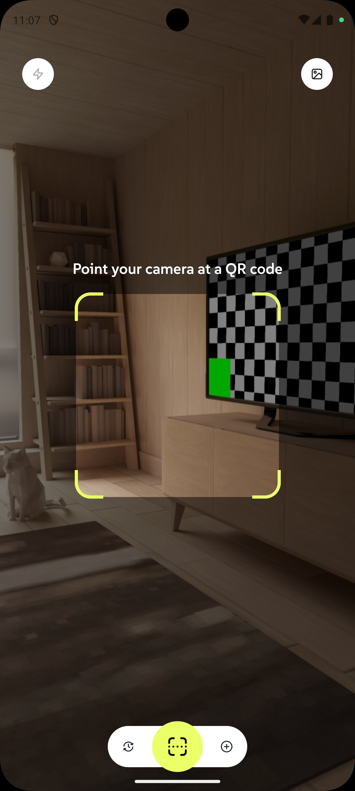
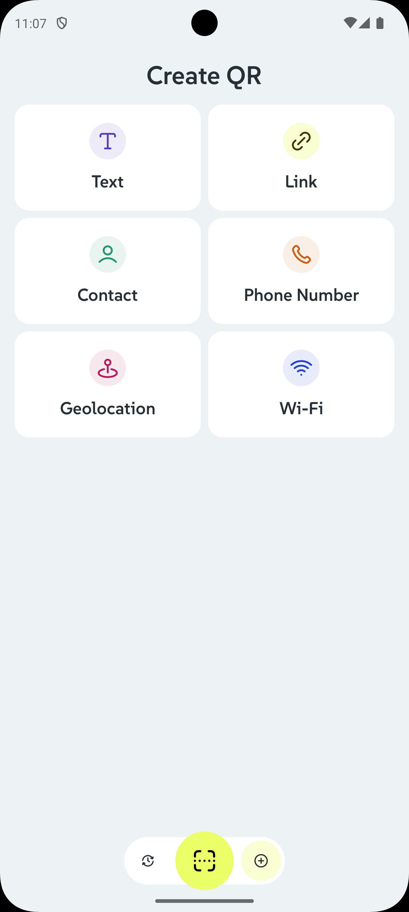
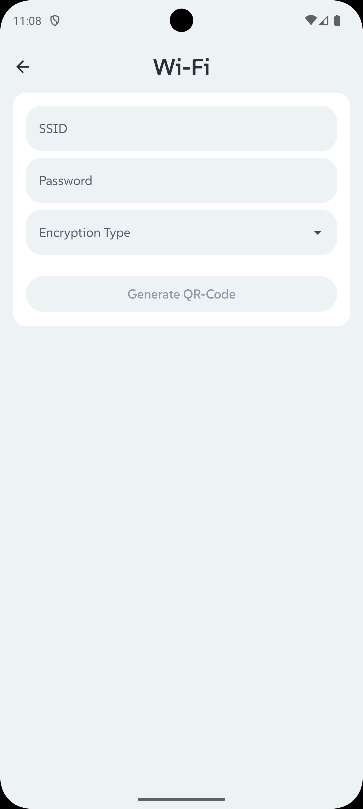
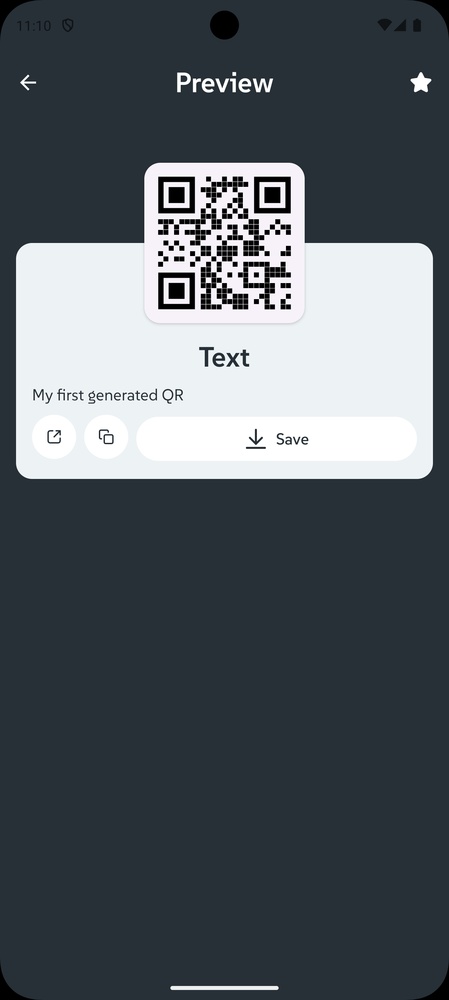
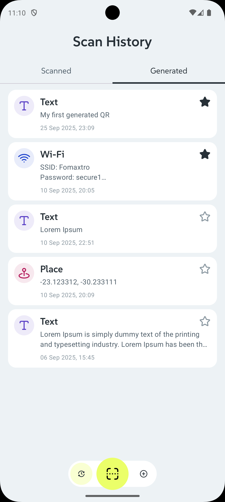

# QR Craft

A modern Android QR code scanner application built for Mobile Dev Campus.

## Overview

QR Craft is a feature-rich QR code scanning application that provides real-time camera scanning with
an intuitive interface. The app captures QR codes through the device camera and displays detailed
results including content type detection and sharing capabilities.

## Features

- **Real-time QR Code Scanning**: Live camera preview with QR code detection
- **Gallery Image Scanning**: Scan QR codes from images in your device gallery
- **Multiple Content Types**: Supports various QR code formats (URLs, text, contacts, WiFi, etc.)
- **Favourite QR Codes**: Mark scanned QR codes as favourites for quick access
- **Save QR Images**: Save generated QR code images directly to Downloads folder
- **Scan History**: View and manage your previously scanned QR codes
- **Share & Copy**: Easy sharing and clipboard functionality for scanned content
- **Modern UI**: Clean interface with custom design system
- **Clean Architecture**: Modular structure with separation of concerns

## Technical Stack

- **Architecture**: Clean Architecture with MVI
- **Camera**: CameraX for QR code scanning
- **Dependency Injection**: Koin
- **Build System**: Gradle with Kotlin DSL

## Screenshots

  
  
  
  
  

## Project Structure

The app follows a multi-module architecture:

- `app/` - Main application module
- `core/data/` - Data layer with repositories and data sources
- `core/domain/` - Business logic and use cases
- `core/presentation/` - UI components and screens

## Author

[Fomaxtro](https://github.com/fomaxtro)

## Licence

Licence under the [MIT License](./LICENCE)
